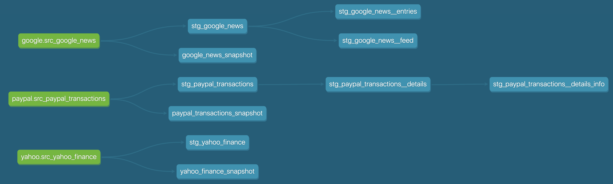

# finance-data-builder

The finance data builder extracts data from several sources, loads it into a postgres database and transforms it 
via dbt into beautiful models.

The data sources are:
* [yahoo! finance](https://finance.yahoo.com/)
* [Google News](https://news.google.com/)

## What it is

### Airflow

I use Airflow to load data into the database:

From **Google News**:


From **yahoo! finance**:


### DBT

I use DBT to transform the data into models:



## Get started

### Prerequisites

- docker
- docker-compose

### Setup

To run this project, simply add a `.env` file to the project root directory, fill it with the following environment 
variables:
```bash
DBT_POSTGRES_HOST=fdb_dbt_db
DBT_POSTGRES_USER=dbt
DBT_POSTGRES_PASSWORD=dbt
DBT_POSTGRES_DB=dbt
DBT_POSTGRES_PORT=5432

AIRFLOW_POSTGRES_HOST=fdb_airflow_db
AIRFLOW_POSTGRES_USER=airflow
AIRFLOW_POSTGRES_PASSWORD=airflow
AIRFLOW_POSTGRES_DB=airflow
AIRFLOW_POSTGRES_PORT=5432

AIRFLOW_USER=airflow
AIRFLOW_PASSWORD=airflow
```
and then run it via `docker-compose`:
```bash
docker-compose up -d
```

### Notes

I am using a `storage` folder for storing data files locally. Normally you probably want the storage to be a remote 
storage that is designed to store large amount of data, such as S3, GCP or Blob Storage.